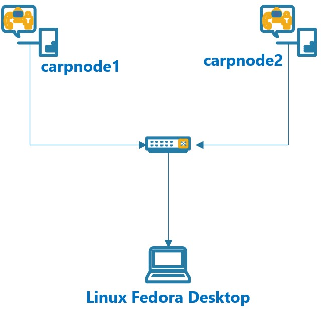
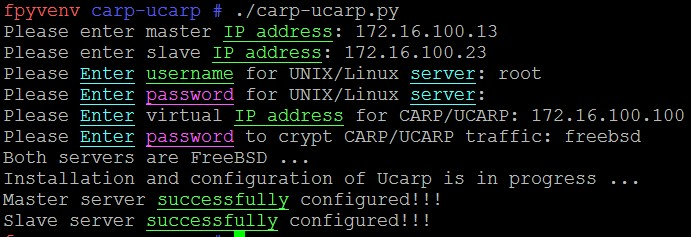
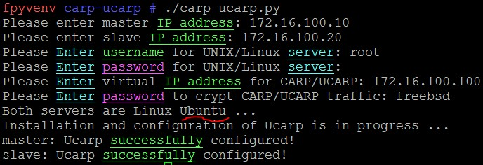
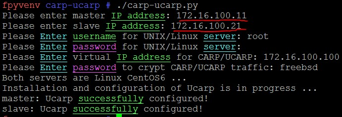
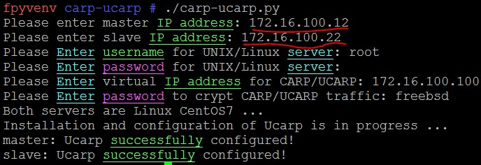
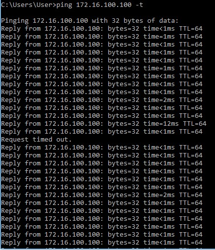

### CARP/UCARP install and configure to UNIX/Linux servers

#####This article describes the python script which automatically installs and configures [CARP](https://en.wikipedia.org/wiki/Common_Address_Redundancy_Protocol) for UNIX (FreeBSD) and [UCARP](http://wiki.greentual.com/index.php/Ucarp) for Linux (Ubuntu, CentOS6 or CentOS7) servers. The script requires an __*IP*__ __*address*__, __*login*__, __*password*__, __*virtual IP*__ and __*CARP password*__ as input parameters. Determination of the type of operating system is performed automatically.

#####The test environment consists of Ubuntu, CentOS6, CentOS7, FreeBSD servers in which the CARP/UCARP will be configured. Each type of OS has 2 machines.

#####Ubuntu          CentOS6         CentOS7         FreeBSD
#####**172.16.100.10   172.16.100.11   172.16.100.12   172.16.100.13**
#####**172.16.100.20   172.16.100.21   172.16.100.22   172.16.100.23**

#####VIP: **172.16.100.100**


#####Only machines of one type of OS can be configured at a time.


#####__Note__: The python script uses fabric library which requires BASH to be installed on all FreeBSD machines. Please use the following commands:
```sh
# pkg install -y bash
# echo "fdesc /dev/fd  fdescfs  rw  0  0" >> /etc/fstab ; mount -a
# chsh -s bash root ; cp /usr/local/bin/bash /bin/
```

#####Execute script to configure servers. 
######FreeBSD:


#####Ubuntu:


#####CentOS6:


#####CentOS7:


#####You can test the system by shutting down the master node while pinging the VIP. Only one ping should be lost.


#####If you try to use different types of operation systems for master and slave nodes, you will get the following notification and script will not perform the installation.

#####Try with FreeBSD and Ubuntu servers:


#####Try with Ubuntu and CentOS6 server:


#####Try with CentOS6 and CentOS7 server:

